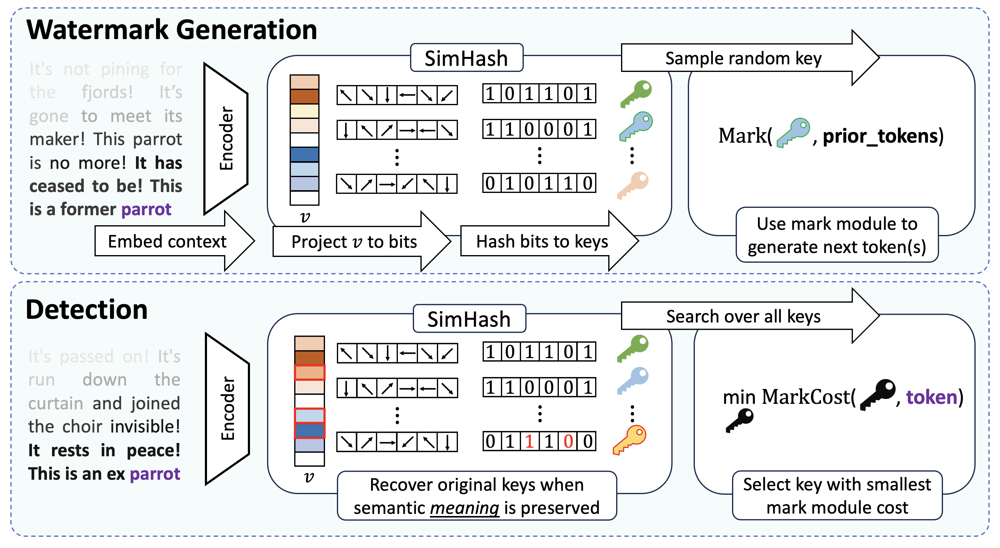

<div align="center">
  <h1>SimKey: A Semantically Aware Key Module for Watermarking Language Models</h1>
  
  
</div>

---

## Quick Start

1. Install the required packages using the following command:
```bash
pip install -r requirements.txt
```

2. Run the experiments using the following command:
```bash
python run.py
```

## SimKey File Structure

```
.
---data
    |---prompts.txt
    |---{generation_name}_{detection_namel}_{attack_name}.txt
---Figures
    |---{plot_type}_{generation_name}_{num_tokens}.png
---simmark
    |---experiments
        |---utils.py # Shared functions for experiments
        |---attacks.py # Attack functions
        |---{experiment}.py
    |---methods
        |---expmin.py
        |---nomark.py
        |---synthid.py
        |---watermax.py
        |---seeding.py # Seed generation functions
```

# Watermark Detection Experiments

This section contains information about three Python scripts for analyzing the statistical properties of watermarked text using p-values and TPRs. These experiments explore how modifications and sentence length affect p-value distributions.

## Files and Descriptions

### 1. `translation_p_value_dist.py`
- **Purpose:** Plots the distributions of p-values for watermarked, unrelated, and watermarked + translation-attacked text.
- **Key Functions:**
  - `plot_p_value_dist_translation()`: Creates the distribution plot for the p-values of the three text types.
  - `plot_all_p_value_dists_translation()`: Runs the experiments to generate p-value distributions for all mark and key module combinations, plotting them together for comparison.
- **Output:** Saves a grid of p-value distribution plots for different watermarking methods and key modules.

### 2. `num_modifications_vs_tpr.py`
- **Purpose:** Analyzes the effect of text modifications on the TPR of watermarked text.
- **Key Functions:**
  - `plot_tpr_modifications()`: Plots the number of modifications against TPR.
  - `generate_tpr_modification_experiment()`: Runs the experiment by modifying text iteratively and testing the TPR for:
    - ExpMin with SimKey
    - ExpMin with standard hashing
    - SynthID with SimKey
    - SynthID with standard hashing
    - WaterMax with SimKey
    - WaterMax with standard hashing
- **Output:** Saves a plot showing how modifications impact TPR of text watermarked using both SimKey and standard hashing.

### 3. `sentence_length_vs_tpr.py`
- **Purpose:** Examines how sentence length affects the TPR under different watermarking conditions.
- **Key Functions:**
  - `plot_sentence_length_tpr()`: Generates a plot of sentence length versus TPR.
  - `sentence_length_tpr()`: Runs experiments with different sentence lengths and compares TPRs for:
    - No watermark
    - ExpMin with SimKey
    - ExpMin with standard hashing
    - SynthID with SimKey
    - SynthID with standard hashing
    - WaterMax with SimKey
    - WaterMax with standard hashing
- **Output:** Saves a plot displaying the relationship between sentence length and TPRs.


## Citation

If you find this work useful for your research, please consider citing our paper:


```
@misc{kodama2025simkeysemanticallyawarekey,
      title={SimKey: A Semantically Aware Key Module for Watermarking Language Models}, 
      author={Shingo Kodama and Haya Diwan and Lucas Rosenblatt and R. Teal Witter and Niv Cohen},
      year={2025},
      eprint={2510.12828},
      archivePrefix={arXiv},
      primaryClass={cs.CR},
      url={https://arxiv.org/abs/2510.12828}, 
}
```